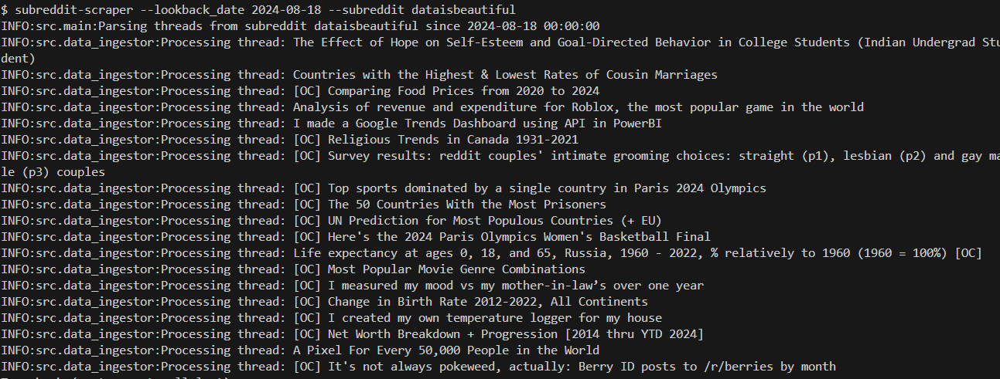
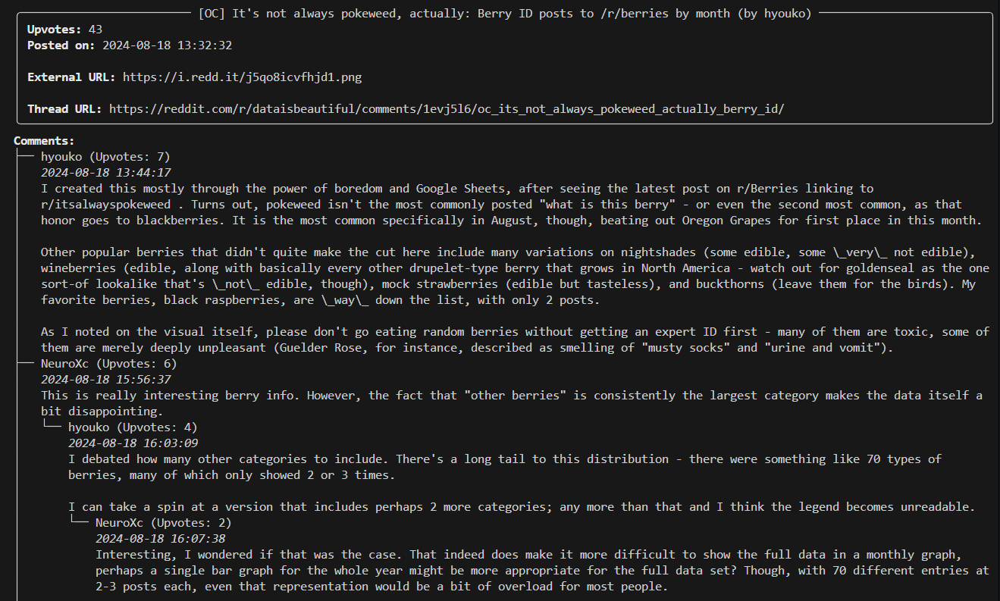

# Subreddit Scraper

A Python-based command-line tool designed to scrape Reddit threads from a specified subreddit using the [praw](https://praw.readthedocs.io/en/stable/) library, store the data in a MySQL database, and display the stored data into the CLI in a formatted manner. The tool handles multiple runs efficiently, ensuring the database is kept up-to-date with any changes in the subreddit threads.

## Table of Contents
- [Setup & Installation](#setup--installation)
  - [Prerequisites](#prerequisites)
  - [Installation](#installation)
- [Usage](#usage)
  - [Ingesting Data](#ingesting-data)
  - [Displaying Data](#displaying-data)
- [Design Considerations & Future Improvements](#design-considerations--future-improvements)
  - [Subreddit Table in Database](#subreddit-table-in-database)
  - [Database Selection](#database-selection)
  - [Parallelism](#parallelism)
  - [Improving Performance for Subsequent Runs](#improving-performance-for-subsequent-runs)
  - [Database Migrations](#database-migrations)

## Setup & Installation

### Prerequisites
This script requires access to a MySQL database and to the Reddit API. 

To learn more on how to install MySQL on your machine, click [here](https://dev.mysql.com/doc/mysql-installation-excerpt/5.7/en/).

Using Reddit's API requires a Reddit account and a registered app. Visit [here](https://www.reddit.com/prefs/apps)
to log in and register an application and grab credentials.

### Installation

1. **Clone the Repository:**
   ```bash
   git clone https://github.com/zakhij/subreddit-scraper
   cd subreddit-scraper
   ```

2. **Create & Activate a Virtual Environment**
    ```bash
    python -m venv venv
    source venv/bin/activate  # On Windows use `venv\Scripts\activate`
    ```

3. **Set up Dependencies & Scripts using Poetry**
    ```bash
    pip install poetry
    poetry install
    ```

4. **Configure Environment Variables**
    
    You must configure a .env file in the root of this project:

    ```
    REDDIT_CLIENT_ID=your_client_id
    REDDIT_SECRET_ID=your_secret_id
    USER_AGENT=python:scraper:v1.0.0 (by /u/your_reddit_username)

    DB_HOST=your_db_host 
    DB_USER=your_db_user
    DB_PASSWORD=your_db_password
    DB_NAME=SubredditScraperDatabase
    ```
5. **Set up the Database**
    
    Run the provided database setup script to create the necessary tables:
    ```bash
    setup-database
    ```


## Usage
To execute this script, pass through command line arguments to the file. The arguments include:
- lookback_date: The date to scrape back to (must be in YYYY-MM-DD format)
- subreddit: The name of the subreddit to scrape 
- subreddit_url: The URL of the subreddit to scrape (mutually exclusive with subreddit arg)

For example:
```bash
subreddit-scraper --looback_date=2024-08-18 --subreddit=dataisbeautiful
```

### Ingesting Data


### Displaying Data


## Design Considerations & Future Improvements

#### Subreddit Table in Database
In addition to tables for threads and comments, I decided to include a table for subreddits inside the database. This improves data integrity in the long-term, especially as subreddits change names or get deleted. The current implementation is bare-bones, but it can be supplemented for future use cases. It can serve as a dimension table to support filtering in data reads (e.g., display thread data for the top X subreddits by subscriber count) and log metadata on previous ingestions (e.g., track latest ingestion date and earliest lookback date for each subreddit) in support of a more standardized ingestion process.

#### Database Selection
I chose a relational database because it aligns with the structured nature of the data, simplifies updates, and supports future use cases that require more complex querying (e.g., grab comments across all threads that have >10 upvotes). The tradeoff, however, is that the relational model is not as well suited to model the hierarchical nature of comments in threads. We get around this by including a parent_comment_id field in the comments table, allowing us to re-build the hierarchy when reading the data; however, a document data model (e.g., MongoDB) would be a natural fit, as it could represent threads as individual documents with nested comment data. More discussions would be needed to determine which approach would be better in the long run, depending on the purpose and future of this data pipeline.  

#### Parallelism
I considered a design that makes use of multithreading to parse through and ingest multiple subreddit threads concurrently. However, this did not result in any performance gains, as parallelism does not circumvent Reddit API rate limiting. If in the future reddit API rate limiting ceases to be the bottleneck, this should be revisited.

#### Improving Performance for Subsequent Runs
The Reddit API rate limiter is the main performance bottleneck on the script. If we were to relax the problem requirements, we could see performance gains for subreddits in which we have already ingested data. In the current design, we assume that thread data must be up-to-date, which requires us to fetch data from Reddit's API to get updated data (e.g., perhaps the upvote count or comment text changed). If stale data was deemed acceptable, we could instead implement a scheme that checks if a thread's data is already stored in the database, reducing the number of API calls (and replacing them with database reads, which are much faster).

#### Database Migrations
In a real world setting where this data ingestion pipeline could be expanded upon, logging and storing database migrations (such as with the alembic library) would be useful in providing visibility and greater evolvability, as opposed to a one-time database setup script as currently provided. 
